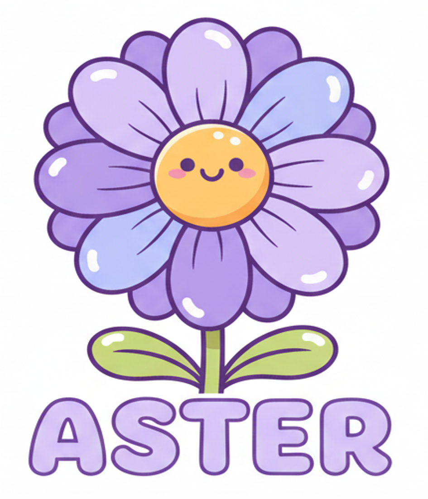
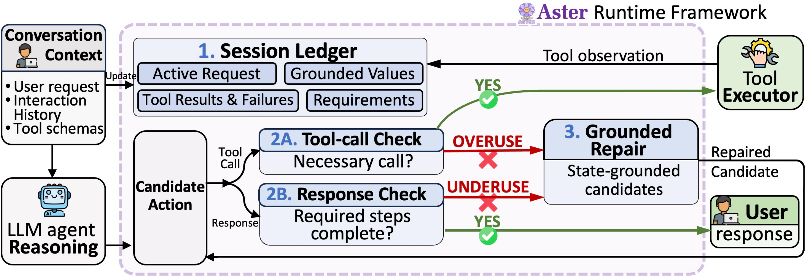

<div align="center">

<div align="center">
    
</div>

<h1 align="center">
Look Back Before You Call: A State-Grounded Framework<br>
for Mitigating Tool-Use Imbalances in LLM Agents
</h1>

[](LICENSE)
[](https://www.python.org/)

</div>

Artifact for the paper **“Look Back Before You Call: A State-Grounded Framework for Mitigating Tool-Use Imbalances in LLM Agents.”**

## Table of Contents

- [Look Back Before You Call](#look-back-before-you-call-a-state-grounded-framework-for-mitigating-tool-use-imbalances-in-llm-agents)
  - [Overview](#overview)
  - [Architecture](#architecture)
    - [1. Session Ledger](#1-session-ledger)
    - [2. Tool-Call and Response Checks](#2-tool-call-and-response-checks)
    - [3. Grounded Repair](#3-grounded-repair)
  - [Usage](#usage)
  - [Main Results](#main-results)
  - [Result Files](#result-files)
  - [Test Data and Reproducibility](#test-data-and-reproducibility)
  - [Citation](#citation)

## Overview

Aster is a runtime guard for multi-turn LLM agents. It records the current request, grounded values, tool results, failures, and open requirements in a session ledger. Before a proposed tool call is executed, Aster checks whether the call is declared, well-formed, and still useful. Before a final response is returned, Aster checks whether a required action or result remains incomplete. A rejected candidate can be replaced by a state-grounded repair while the underlying model remains unchanged.

<div align="center">
    
    <p>Overview of the Aster runtime framework.</p>
</div>

## Architecture

The public runtime implements the three checks used by Aster:

### 1. Session Ledger

The ledger keeps session-scoped observations:

- the active request and tool declarations;
- successful and failed tool receipts;
- stable fingerprints for previously attempted transitions;
- requirements that must be satisfied before final output.

The ledger records observations and does not infer domain facts from tool names.

### 2. Tool-Call and Response Checks

Aster inspects both candidate action types:

- **Tool-call check:** verifies the tool declaration, required arguments, unexpected arguments, and repeated transitions.
- **Response check:** verifies that the candidate response does not close the interaction while a required state-changing step remains open.

This separation targets both tool overuse and premature completion.

### 3. Grounded Repair

When a candidate is rejected for an unresolved requirement, Aster reports the missing requirement and, when the host provides enough information, exposes a repair candidate. The host remains responsible for model inference and tool execution; Aster never fabricates a tool receipt.

## Usage

Install the package and run the included example:

```bash
python -m venv .venv
. .venv/bin/activate
pip install -e .
python examples/minimal_loop.py
python -m unittest discover -s tests -v
```

A minimal host integration looks like this:

```python
from aster import AsterPolicy, CandidateAction, SessionLedger, ToolSpec

policy = AsterPolicy([
    ToolSpec(
        name="lookup_weather",
        description="Read current weather for a city.",
        parameters={"city": {"type": "string"}},
        required_parameters=("city",),
    )
])
ledger = SessionLedger()

candidate = CandidateAction.tool("lookup_weather", {"city": "Shenzhen"})
decision = policy.inspect(candidate, ledger)

if decision.accepted:
    receipt = host_execute(candidate.tool_call)
    policy.observe(candidate.tool_call, receipt, ledger=ledger)
```

The host controls model calls and tool execution. Aster only checks the candidate transition and records the returned receipt.

## Main Results

The repository includes the final non-ablation aggregate results for 224 ToolSandbox scenarios and 200 BFCL scenarios per model-condition.

| Model | ToolSandbox TS | BFCL TS |
| --- | ---: | ---: |
| Llama-3.1-8B | 8.5% | 25.5% |
| Mistral-7B-v0.3 | 7.6% | 4.5% |
| Qwen2.5-7B | 11.2% | 22.5% |
| Qwen3.7-Plus | 13.8% | 64.0% |

Aster achieves the highest task-success rate in all eight model–benchmark settings reported in the main table. The full aggregate table also contains Prompting, SMARTAgent, and MetaAgent baselines.

## Result Files

- [`results/main_results.csv`](results/main_results.csv): one row per benchmark/model/method condition.
- [`results/main_results.json`](results/main_results.json): the same rows with provenance metadata.
- [`results/README.md`](results/README.md): metric definitions and scope.

Only main evaluation rows are included. Ablation results, raw trajectories, API responses, model caches, and private experiment logs are not included in this repository.

## Test Data and Reproducibility

The public repository contains the cleaned runtime core and aggregate results. The original benchmark implementations, official evaluators, model checkpoints, and large raw trajectories remain governed by their respective licenses and are not redistributed here.

The aggregate table can be regenerated from the paper's summary JSON with:

```bash
python scripts/export_main_results.py \
  --source /path/to/evaluation_table_data.json \
  --output results
```

The exporter writes only the main-result fields and explicitly marks the output as non-ablation data.

## Citation

```bibtex
@software{aster_toolusage,
  title  = {Aster: State-Grounded Tool-Use Checks},
  year   = {2026},
  url    = {https://github.com/ycshao12/Aster_ToolUsage}
}
```

## License

The cleaned runtime code is released under the MIT License. Benchmark assets remain subject to their original licenses.
